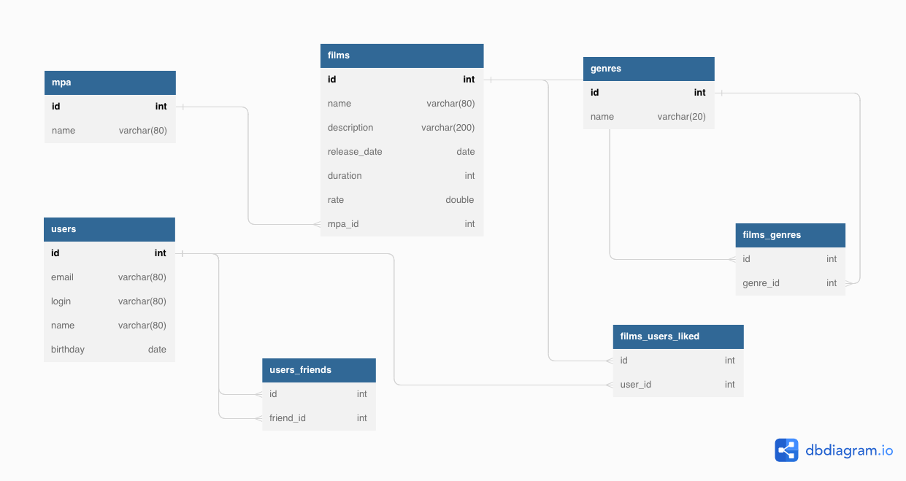

# java-filmorate

Описание таблиц БД
---
Тут 7 таблиц:
films, users - данные фильмов/пользователей, genres - жанры

films_users_liked - лайкнутые пользователями фильмы. таблица для соединения многих-ко-многим. У каждого фильма могут
быть лайки от множества пользователей, у пользователей могут быть лайки ко множеству фильмов.

films_genres - жанры фильмов. также таблица для м-н-м. У каждого фильма может быть множества тегов, и наоборот.

mpa_rating - MPA-рейтинги. соединение 1 ко многим. У каждого фильма может быть только 1 рейтинг, у каждого рейтинга
множество фильмов.

users_friends - таблица для отслеживания статуса дружбы/подписки. Чтобы быть "другом", нужно чтобы в таблице были 2
записи "А подписан на Б", и "Б подписан на А", если одной из записей нет, это статус "подписка", если обоих записей нет,
то пользователи не связаны дружбой.

Код для создания базы данных schema.sql:

```h2
CREATE TABLE IF NOT EXISTS mpa_rating
(
    mpa_rating_id varchar(80) PRIMARY KEY,
    rating_name   varchar(80)
);


CREATE TABLE IF NOT EXISTS films
(
    film_id       int PRIMARY KEY AUTO_INCREMENT,
    name          varchar(80),
    description   varchar(200),
    release_date  date,
    duration      int,
    rate          double,
    mpa_rating_id int,
    FOREIGN KEY (mpa_rating_id) REFERENCES mpa_rating (mpa_rating_id)
);


CREATE TABLE IF NOT EXISTS genres
(
    genre_id   int PRIMARY KEY,
    genre_name varchar(20)
);

CREATE TABLE IF NOT EXISTS films_genres
(
    genre_id int NOT NULL,
    film_id  int NOT NULL,
    FOREIGN KEY (genre_id) REFERENCES genres (genre_id),
    FOREIGN KEY (film_id) REFERENCES films (film_id),
    UNIQUE (genre_id, film_id)
);

CREATE TABLE IF NOT EXISTS users
(
    user_id  int         NOT NULL PRIMARY KEY AUTO_INCREMENT,
    email    varchar(80) NOT NULL UNIQUE,
    login    varchar(80) UNIQUE,
    name     varchar(80),
    birthday date
);

CREATE TABLE IF NOT EXISTS users_friends
(
    user_id   int NOT NULL,
    friend_id int NOT NULL,
    UNIQUE (user_id, friend_id),
    FOREIGN KEY (user_id) REFERENCES users (user_id),
    FOREIGN KEY (friend_id) REFERENCES users (user_id)
);


CREATE TABLE IF NOT EXISTS films_users_liked
(
    user_id int NOT NULL,
    film_id int NOT NULL,
    FOREIGN KEY (user_id) REFERENCES users (user_id),
    FOREIGN KEY (film_id) REFERENCES films (film_id),
    UNIQUE (user_id, film_id)
);
```

Код для заполнения тестовыми данными(примеры запросов) data.sql

```h2
-- Добавляем рейтинги

MERGE
INTO mpa_rating
    VALUES (1, 'G');

MERGE
INTO mpa_rating
    VALUES (2, 'PG');

MERGE
INTO mpa_rating
    VALUES (3, 'PG_13');

MERGE
INTO mpa_rating
    VALUES (4, 'R');

MERGE
INTO mpa_rating
    VALUES (5, 'NC_17');

-- Добавляем жанры фильмов

MERGE
INTO genres
    VALUES (1, 'Comedy');

MERGE
INTO genres
    VALUES (2, 'Drama');

MERGE
INTO genres
    VALUES (3, 'Cartoon');

MERGE
INTO genres
    VALUES (4, 'Thriller');

MERGE
INTO genres
    VALUES (5, 'Documentary');

MERGE
INTO genres
    VALUES (6, 'Action');


-- Добавляем пользователей
MERGE
INTO users
    VALUES (1, 'anna@gmail.com', 'anna', 'Anna', '2000-01-01');

MERGE
INTO users
    VALUES (2, 'joe@gmail.com', 'joelogin', 'Joe', '2005-05-01');

MERGE
INTO users
    VALUES (3, 'joe2@gmail.com', 'joelogin2', 'Joe', '2005-05-01');


-- Добавляем фильмы
MERGE
INTO films
    VALUES (1, 'Фильм 1', 'Описание фильма 1 ', '2010-01-01', 120, 5.0, 1);

MERGE
INTO films
    VALUES (2, 'Фильм 2', 'Описание фильма 2', '2015-01-01', 150, 9.0, 2);


MERGE
INTO films
    VALUES (3, 'Фильм 3', 'Описание фильма 3', '2012-01-01', 150, 8.2, 2);

-- Обновляем фильм
UPDATE films
SET films.name='Фильм 1 новое имя'
WHERE films.film_id = 1;

-- Удаляем фильм
DELETE
FROM films
WHERE films.film_id = 3;


-- Обновляем пользователя
UPDATE users
SET users.name='Anna 2'
WHERE users.user_id = 1;

-- Удаляем пользователя
DELETE
FROM users
WHERE users.user_id = 3;

-- Односторонняя дружба
INSERT
INTO users_friends (user_id, friend_id)
VALUES (1, 2);

-- Без дружбы
DELETE
FROM users_friends
WHERE users_friends.user_id = 1
  AND users_friends.friend_id = 2;


-- Двусторонняя дружба

INSERT
INTO users_friends (user_id, friend_id)
VALUES (1, 2);

INSERT
INTO users_friends (user_id, friend_id)
VALUES (2, 1);


-- добавление лайка фильму
INSERT
INTO films_users_liked (user_id, film_id)
VALUES (1, 1);

-- удаление лайка у фильма
DELETE
FROM films_users_liked
WHERE films_users_liked.film_id = 1
  AND films_users_liked.user_id = 1;
```

